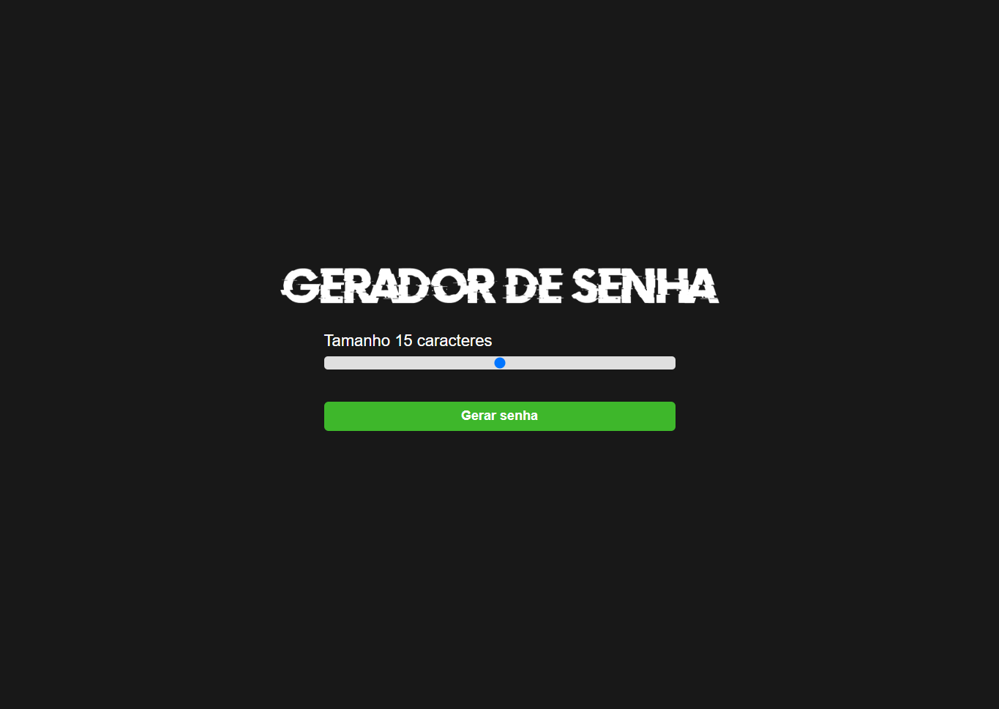

# Gerador de Senhas

Projeto desenvolvido a fins de prática na programação utilizando ferramentas básicas de aprendizado.

[🔗 Clique aqui para acessar](https://gerador-de-senhas-voku.vercel.app/)

## 🛠 Tecnologias

- HTML
- CSS
- JavaScript
- Github

## 💜 Contato
[LinkedIn](https://www.linkedin.com/in/diego-bonze-518225208/)

diegobonze747@gmail.com